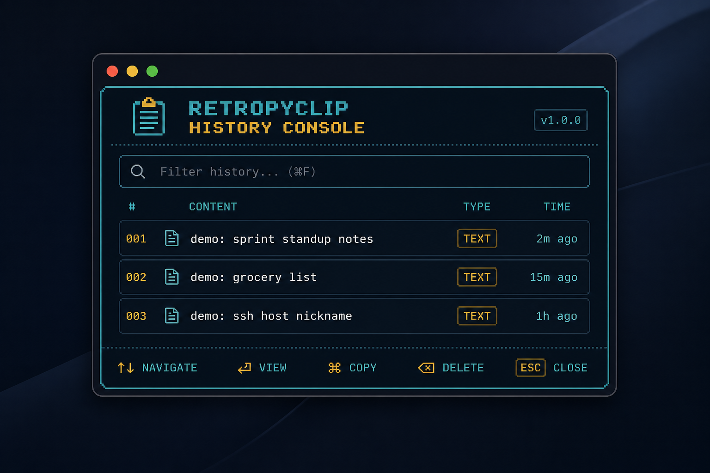
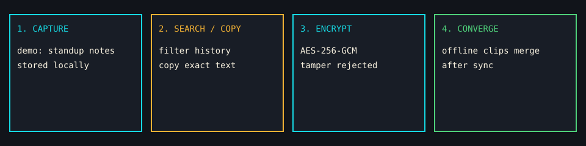

<div align="center">

# RetroPyClip

Private-first, text-only clipboard history for macOS and Linux.
Local SQLite on your machine. Optional AES-256-GCM sync through *your*
Google Drive `appDataFolder`. No RetroPyClip-operated server.

[](https://github.com/VaughnDV/retropyclip/actions/workflows/ci.yml)
[](LICENSE)
[](pyproject.toml)
[](https://docs.astral.sh/uv/)
[](https://github.com/astral-sh/ruff)
[](https://mypy-lang.org/)
[](CHANGELOG.md)



<sub>Synthetic demo data only. Capture, filter, and copy stay local.</sub>

[Features](#features) ·
[Quick start](#quick-start) ·
[CLI](#cli) ·
[Tray](#optional-tray) ·
[Sync](#google-drive-sync) ·
[Security](#security) ·
[Development](#development)

</div>

> **Prototype.** Clipboard history often contains passwords, tokens, and personal
> data. Read the [threat model](docs/threat-model.md) before using this with real
> clips.
>
> **Local history is not application-encrypted.** The SQLite database is plaintext
> so search and the tray can run in an unlocked session. Use FileVault or LUKS.
> Remote Drive records *are* AES-256-GCM. See
> [at-rest encryption](docs/at-rest-encryption.md).

<p align="center">
  
</p>

## Features

| Local | Optional sync |
|---|---|
| Text-only capture (never images or files) | AES-256-GCM envelopes, Argon2id wrapping |
| 120-item default retention, deterministic order | Immutable one-file-per-record in Drive `appDataFolder` |
| Immediate duplicate suppression | Offline-safe retry and remote deduplication |
| Pause / resume before handling secrets | Concurrent-device merge with tombstones |
| JSON and text export / import | Same passphrase on every device; key never uploaded |
| Headless CLI on every supported platform | No RetroPyClip account, telemetry, or hosted backend |

Clipboard adapters: macOS (`pbcopy` / `pbpaste`), X11 (`xclip` or `xsel`), Wayland
(`wl-copy` / `wl-paste`), plus a GNOME Shell bridge where the compositor does not
expose data-control. Architecture:
[docs/architecture.md](docs/architecture.md).

## Requirements

| | |
|---|---|
| Python | 3.12 or 3.13 |
| Tooling | [`uv`](https://docs.astral.sh/uv/) (recommended) |
| macOS | Clipboard tools are built in |
| Ubuntu X11 | `xclip` or `xsel` |
| Ubuntu Wayland | `wl-clipboard`; GNOME needs the bundled Shell bridge |
| Headless Pi | No clipboard utility; use `add`, `show`, `push`, `pull` |
| Disk encryption | FileVault or LUKS for the local database |

Windows is not supported.

## Quick start

```bash
git clone https://github.com/VaughnDV/retropyclip.git
cd retropyclip
uv sync --all-extras
uv run retropyclip doctor
```

Safe synthetic walkthrough (isolated `RETROPYCLIP_HOME`, no real OAuth):

```bash
make demo
```

Headless install without the tray extra:

```bash
uv sync
uv run retropyclip add "hello from this device"
uv run retropyclip history
```

<details>
<summary>Ubuntu desktop updates and clipboard helpers</summary>

On Ubuntu X11 install either `xclip` or `xsel`. On Wayland install `wl-clipboard`.

Wayland watching uses the compositor data-control protocol (Sway, Hyprland).
Standard Ubuntu GNOME Wayland does not expose that to ordinary apps, so
`ubuntu-update.sh` installs a small bundled GNOME Shell bridge that forwards
text over the private desktop session bus. The first install may ask for one
logout/login. RetroPyClip never repeatedly polls `wl-paste`, because that
fallback can flash a paste window on unsupported compositors.

After cloning, later updates:

```bash
git pull --ff-only
./ubuntu-update.sh
```

The updater installs a missing X11/Wayland clipboard utility through `apt`,
refreshes the locked Python environment, runs `doctor`, and restarts only this
checkout's tray. Diagnostics live under `~/.local/state/retropyclip/`.

</details>

## CLI

```bash
retropyclip add "hello"
printf 'piped text' | retropyclip add
retropyclip history
retropyclip show ITEM_ID
retropyclip copy ITEM_ID
retropyclip daemon
```

`daemon` watches the desktop clipboard and records **text** changes until
interrupted. Pause before handling known-sensitive material:

```bash
retropyclip pause --minutes 5
```

| Command | Purpose |
|---|---|
| `add` | Record text from an argument or stdin |
| `history` | List stored items |
| `show` / `copy` | Print or copy one item (full ID or unique prefix) |
| `daemon` | Watch the clipboard |
| `pause` / `resume` | Stop or start capture |
| `login` / `logout` / `status` | Drive authentication |
| `sync` / `push` / `pull` | Encrypted Drive sync |
| `clear-local` / `clear-everywhere` | Wipe this device, or this device plus remote tombstones |
| `export` / `import` | JSON or text |
| `doctor` | Check the local environment |
| `configure` | Adjust settings |

## Optional tray

```bash
uv sync --extra gui
uv run retropyclip-tray
```

The tray includes grouped history, Sync Now, pause, clearing, and preferences.
On macOS, `Cmd+Shift+V` opens the history console from any app: type to filter,
Up/Down to browse, Enter or click to paste, Escape to close. The shortcut uses
native hotkey registration.

<details>
<summary>macOS Accessibility for automatic paste</summary>

Automatic paste needs Accessibility permission. The first selection prompts;
enable RetroPyClip under **System Settings → Privacy & Security → Accessibility**.
During development, macOS may list it as Python or the terminal that launched it
(for example Warp). Restart the picker after granting access. Without permission,
the selection is still copied, so `Cmd+V` remains a fallback.

Packaging, signing, notarisation, launch-at-login, configurable shortcuts, and a
Linux-wide shortcut are release work, not prototype claims.

</details>

## Google Drive sync

Create an OAuth client in **your** Google Cloud project
([setup guide](docs/google-oauth-setup.md)), then:

```bash
retropyclip login --client-secrets /safe/path/client_secret.json
retropyclip sync
```

The first sync asks for a passphrase and stores non-secret Argon2id metadata in
`appDataFolder`. Use the same passphrase on every device. The passphrase and
derived key are never uploaded.

For unattended sync, `RETROPYCLIP_SYNC_PASSPHRASE` is accepted; environment
variables can be read by other processes owned by the same user.

`retropyclip status` reports local state and auth readiness. Downloaded clips
enter history and **never** replace the current clipboard automatically.

## Security

| Protected | Not protected against |
|---|---|
| Clip plaintext on Drive, given a strong passphrase | Weak passphrases |
| Authenticated remote records | Drive deletion or replay |
| Concurrent-device merge and tombstones | Clock skew in display order |
| Keyring / `0600` token files | Malware in an unlocked user session |
| Pause and text-only capture | Secrets that look like ordinary text |
| Isolated demo homes | Local DB without FileVault or LUKS |

There is no operated server and no telemetry ([privacy](docs/privacy.md)).
Report vulnerabilities privately per [SECURITY.md](SECURITY.md). Never include
real clipboard contents in issues or reports.

**Data locations.** User data and config use `platformdirs`. For isolated
testing, set `RETROPYCLIP_HOME`. OAuth tokens use the OS keyring when available,
otherwise a mode-`0600` file. Do not commit OAuth client files, tokens,
databases, logs, or recovery material.

## Development

```bash
uv sync --all-extras
make check
make test
```

| Target | What it runs |
|---|---|
| `make check` | Ruff lint/format and mypy |
| `make test` | pytest with coverage gate |
| `make package` | Wheel/sdist plus packaging smoke |
| `make audit` | Licence / dependency audit |
| `make sbom` | CycloneDX SBOM |
| `make demo` | Isolated synthetic demo |

Install git hooks with `uvx pre-commit install`. See [CONTRIBUTING.md](CONTRIBUTING.md).

## Documentation

| | |
|---|---|
| [Architecture](docs/architecture.md) | Components and data flow |
| [Threat model](docs/threat-model.md) | What this build does and does not claim |
| [Crypto](docs/crypto.md) / [key rotation](docs/key-rotation.md) | Envelopes and passphrase wrapping |
| [Troubleshooting](docs/troubleshooting.md) | Common desktop and sync failures |
| [Compatibility matrix](docs/compatibility-matrix.md) | Claimed platforms and evidence |
| [Roadmap](docs/roadmap.md) / [changelog](CHANGELOG.md) | What is next and what changed |
| [Release](docs/release.md) | How a signed alpha would be cut |

Also: [name clearance](docs/name-clearance.md),
[secret scan](docs/secret-scan.md),
[security review](docs/security-review.md),
[licence audit](docs/license-audit.md),
[feasibility checklist](docs/feasibility-checklist.md).

## License

[MIT](LICENSE).
