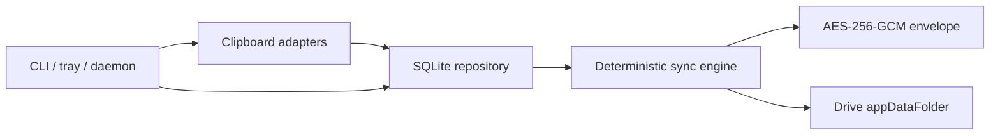

# Architecture

RetroPyClip separates clipboard I/O, local storage, cryptography, remote transport,
and merge policy so each can be tested independently.

## Local model

Every captured clip receives a UUIDv7, UTC capture time, stable device ID, friendly
device name, and monotonically increasing per-device sequence. History ordering is
`captured_at DESC, device_id, sequence DESC, id`, providing deterministic tie-breaks.
Line endings are normalized to LF; other text is preserved exactly.

SQLite is the user-facing source of truth while offline. A schema-version row makes
future migrations explicit. Remote file IDs are remembered so repeat pulls are
idempotent. Local retention hides old rows without publishing a deletion.

## Remote model

Each clip or tombstone is encrypted into one versioned JSON envelope and uploaded
as `<record-id>.rpc.json`. Files are immutable. Concurrent devices therefore add to
a set instead of racing to edit one shared file. A tombstone points to a target clip
ID; merge order does not matter because a clip imported after its tombstone is
immediately hidden.

The only non-record object is `retropyclip.keyinfo.v1.json`. It contains the random
Argon2id salt, work parameters, and a keyed verifier. These are not secret. The
passphrase and derived AES key stay local. Initial key metadata should be established
on the first device before another device attempts its first sync. The envelope,
associated-data, and nonce rules are specified in [crypto.md](crypto.md).

## Sync algorithm

1. Load or establish shared KDF metadata and verify the supplied passphrase.
2. List remote objects and pull unseen immutable records.
3. Validate envelope schema and size, authenticate/decrypt, then insert by record ID.
4. Upload unsynchronized local clips and tombstones as new immutable files.
5. Apply local retention and report the final state.

Pull-before-push lets a joining device adopt the established KDF configuration.
Operations retry transient failures with bounded exponential backoff and jitter.
Exhausted retries surface as `offline`. Quota exhaustion and authentication failure
are terminal states (`error` / `authentication_required`) and are not retried.
Downloading a clip never changes the active system clipboard.

Copying an old history item suppresses the next recapture of that exact text. It
does not insert a duplicate and does not refresh `captured_at`. See
[desktop-permissions.md](desktop-permissions.md).
